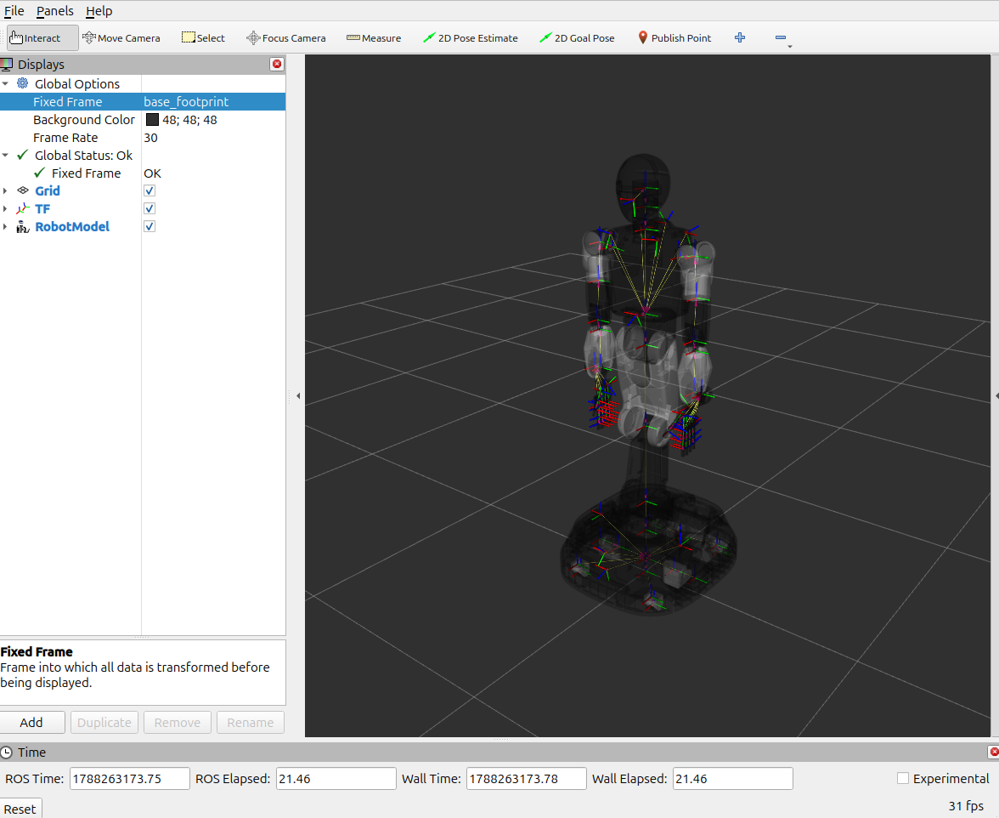

# friday_ros2

Public ROS 2 packages for the Friday.

## Packages

- `friday_ros2`: meta-package for the public Friday ROS 2 packages.
- `friday_description`: robot URDF, MJCF, meshes, and visualization launch
  files.
- `friday_manipulation`: one-shot joint-space and Cartesian-space manipulation
  examples.
- `friday_msgs`: public ROS 2 interfaces for Friday.
- `friday_teleop`: keyboard teleoperation launch files.

## Public Interfaces

`friday_msgs` provides the public message and service contracts used by Friday.

- Robot and hardware state: `BatteryState`, `BoardStateArray`,
  `BumperStateArray`, `EmergencyStop`, `JointLockState`,
  `LoadCellStateArray`, `MotorStateArray`, `RangeStateArray`, and
  `TactileStateArray`.
- Static sensor metadata: `TactileLayout`.
- Robot control: `ControlMode`, `Manipulation`, `JointReaching`,
  `LinkReaching`, and `ViewReaching`.
- Avoidance state: `AvoidanceState`, including per-part-pair
  `CollisionPairState` entries.
- Cameras: `CameraControl`, one runtime control and its value, and
  `ExternalVideoStreamStatus`, one camera's external video stream.
- Services: `GetBatteryAlarm`, `GetCameraList`, `GetExternalVideoStreamStatus`,
  `GetMotorLimits`, `ResetBoardFaults`, `SetAvoidanceEnabled`, `SetBatteryAlarm`,
  `SetCollisionPairEnabled`, `SetControlMode`, `SetExternalCameraControls`,
  `SetExternalVideoStreaming`, `SetMotorCurrentLimit`, `SetMotorVelocityLimit`,
  and `SetRangeSensorEnabled`.

## Build

Clone the repository:

```bash
git clone https://github.com/Holiday-Robot/friday_ros2.git
cd friday_ros2
```

### Local

Requires ROS 2 Jazzy Desktop, CycloneDDS (`ros-jazzy-rmw-cyclonedds-cpp`),
`colcon`, and initialized `rosdep` on the host.

```bash
source /opt/ros/jazzy/setup.bash
rosdep install --from-paths . --ignore-src -r -y
colcon build --base-paths . --symlink-install
source install/setup.bash
export RMW_IMPLEMENTATION=rmw_cyclonedds_cpp
export ROS_DOMAIN_ID=${ROS_DOMAIN_ID:-138}
```

### Container

On a Linux host with Docker, build the development image and start a shell:

```bash
./script/docker-build.sh
./script/docker-run.sh
```

The image includes ROS 2 Jazzy Desktop, CycloneDDS, and dependencies from
`package.xml`. The shell starts at `/workspace`, with this repository bind-mounted
at `/workspace/src/friday_ros2`. `ROS_DOMAIN_ID` defaults to `138`; the run script
uses the host's value if set.

Build inside the container:

```bash
colcon build --symlink-install
source /workspace/install/setup.bash
```

To open another shell, run this from the host repository directory:

```bash
./script/docker-exec.sh
```

This requires exactly one running container mounting this repository. Source
`/workspace/install/setup.bash` in each new shell to use the built packages.
Exiting the original run shell removes the container and its build artifacts;
files under the source bind mount remain on the host.

## Launch Friday Description



Start `robot_state_publisher` and RViz:

```bash
ros2 launch friday_description friday_state_publisher.launch.py
```

> **NOTICE:** In RViz, select `friday_description/urdf/FM26B.urdf` for
> `RobotModel.DescriptionFile` to display the model correctly.

Enable the joint state publisher GUI:

```bash
ros2 launch friday_description friday_state_publisher.launch.py use_joint_state_publisher_gui:=true
```

## MuJoCo Model

`friday_description/mjcf/FM26A.mjcf` is a MuJoCo model of the same robot,
generated from the source the URDF comes from. It loads directly:

```bash
python -m mujoco.viewer --mjcf friday_description/mjcf/FM26A.mjcf
```

It shares the package's `meshes/` tree with the URDF rather than carrying its
own copy, via `<compiler meshdir="../meshes">`. Keep the `mjcf/` directory next
to `meshes/` when copying the model elsewhere, or point `meshdir` at wherever
the meshes ended up.

The model carries the kinematic tree with a free-floating base, position
actuators for the hand, arm, waist, and head joints, velocity actuators for the
two drive wheels, and the named poses (`ready`, `rest`, `grab`, `release`) as
keyframes. Collision geometry uses `contype`/`conaffinity` bitmasks encoding the
self-collision allowlist; the legend is a comment in the `<default>` block.
There is no ground plane — add one in your own scene.

## Launch Keyboard Teleop

This example lets you drive Friday interactively by publishing keyboard input as velocity commands.

Before using keyboard teleop , turn on the robot torque and enable the controller:

```bash
ros2 service call holiday/joints/torque/set_enabled std_srvs/srv/SetBool '{data: true}'
ros2 service call holiday/control/set_enabled std_srvs/srv/SetBool '{data: true}'
```

Start `teleop_twist_keyboard` for `holiday/cmd_vel`:

```bash
ros2 launch friday_teleop teleop_twist_keyboard.launch.py
```

### Keyboard controls

Run the launch command in an interactive terminal and keep that terminal
focused while driving. Start at a low speed in a clear workspace. Press a
movement key to publish a velocity command, press `k` or any unlisted key to
stop, and press `Ctrl-C` to exit. A US keyboard layout is recommended.

The controller currently uses only forward/backward velocity and yaw. Strafing
and vertical-motion keys have no effect.

```text
This node takes keypresses from the keyboard and publishes them
as Twist/TwistStamped messages. It works best with a US keyboard layout.
---------------------------
Moving around:
   u    i    o
   j    k    l
   m    ,    .

For Holonomic mode (strafing), hold down the shift key:
---------------------------
   U    I    O
   J    K    L
   M    <    >

t : up (+z)
b : down (-z)

anything else : stop

q/z : increase/decrease max speeds by 10%
w/x : increase/decrease only linear speed by 10%
e/c : increase/decrease only angular speed by 10%

CTRL-C to quit

currently:  speed 0.03  turn 0.15
```

The `currently` values show the active linear and angular speed scales.
Override their initial values with the `speed` and `turn` launch arguments:

```bash
ros2 launch friday_teleop teleop_twist_keyboard.launch.py speed:=0.10 turn:=0.20
```

The launch file attaches `teleop_twist_keyboard` stdin to `/dev/tty`, so run it
from an interactive terminal. Non-interactive shells and sessions without a TTY
cannot provide keyboard input.

## Run Manipulation Examples

These examples publish one command to a running Friday controller and then exit.
Verify that the robot workspace is clear before running them.

Before using running a manipulation example, turn on the robot torque and enable the controller:

```bash
ros2 service call holiday/joints/torque/set_enabled std_srvs/srv/SetBool '{data: true}'
ros2 service call holiday/control/set_enabled std_srvs/srv/SetBool '{data: true}'
```

### `joint_space`

Move every controllable joint to zero:

```bash
ros2 run friday_manipulation joint_space init_pose
```

Move the waist and arms to the ready pose while commanding the hands and head to zero:

```bash
ros2 run friday_manipulation joint_space ready_pose
```

The command requires one positional argument:

| Argument | Accepted values           | Description                                                  |
| -------- | ------------------------- | ------------------------------------------------------------ |
| `POSE`   | `init_pose`, `ready_pose` | Predefined joint-space pose to publish. There is no default. |

Both presets command all 62 waist, arm, hand, and head joints. Joint positions
are expressed in radians:

| Joint group | Joint names                                                        | Count | `init_pose` | `ready_pose`                                    |
| ----------- | ------------------------------------------------------------------ | ----: | ----------- | ----------------------------------------------- |
| Waist       | `waist_1` through `waist_5`                                        |     5 | All `0.0`   | `[0.0, -0.48, 0.96, -0.48, 0.0]`                |
| Left arm    | `left_arm_1` through `left_arm_7`                                  |     7 | All `0.0`   | `[-0.92, 0.74, 0.0, -1.27, 0.44, 0.09, 0.0]`    |
| Right arm   | `right_arm_1` through `right_arm_7`                                |     7 | All `0.0`   | `[-0.92, -0.74, 0.0, -1.27, -0.44, -0.09, 0.0]` |
| Left hand   | `left_hand_<finger>_<joint>`, with `finger=1..5` and `joint=1..4`  |    20 | All `0.0`   | All `0.0`                                       |
| Right hand  | `right_hand_<finger>_<joint>`, with `finger=1..5` and `joint=1..4` |    20 | All `0.0`   | All `0.0`                                       |
| Head        | `head_1` through `head_3`                                          |     3 | All `0.0`   | All `0.0`                                       |

The command does not accept individual joint names; the selected preset always
publishes targets for every joint in the table.

Show the built-in argument help:

```bash
ros2 run friday_manipulation joint_space --help
```

### `cartesian_space`

Move `right_arm_7` 0.10 m along the positive `base_link` X axis from its current
pose while preserving its orientation:

```bash
ros2 run friday_manipulation cartesian_space
```

The command accepts the following arguments:

| Argument                  | Default           | Description                                                                                                                                                     |
| ------------------------- | ----------------- | --------------------------------------------------------------------------------------------------------------------------------------------------------------- |
| `--reference-frame FRAME` | `base_link`       | Frame in which the current pose and offsets are expressed.                                                                                                      |
| `--target-frame FRAME`    | `right_arm_7`     | End-effector frame to command.                                                                                                                                  |
| `--target-pos X Y Z`      | `0.10 0.0 0.0`    | Translation offset in meters, added to the current target-frame position.                                                                                       |
| `--target-quat X Y Z W`   | `0.0 0.0 0.0 1.0` | Rotation offset quaternion. It is normalized and composed as `offset * current orientation`. The default identity quaternion preserves the current orientation. |

For example, move `right_arm_7` 0.15 m along the positive `base_link` Z axis
and rotate it 90 degrees around that axis:

```bash
ros2 run friday_manipulation cartesian_space \
  --reference-frame base_link \
  --target-frame right_arm_7 \
  --target-pos 0.0 0.0 0.15 \
  --target-quat 0.0 0.0 0.7071 0.7071
```

Show the built-in argument help:

```bash
ros2 run friday_manipulation cartesian_space --help
```

## Data Recording

After building and sourcing the workspace, run the recording script:

```bash
./script/data-record.sh
```

Both arguments are optional:

```text
./script/data-record.sh [output_dir] [selection]
```

| Argument | Default | Description |
| --- | --- | --- |
| `output_dir` | `/workspace/src/friday_ros2/record` | Parent directory for timestamped recordings. Pass `""` to keep the default when specifying a selection. |
| `selection` | `ALL` | A group, an absolute topic name, or a quoted list combining them. |

| Group | Recorded data |
| --- | --- |
| `ALL` | All non-hidden topics and service events. Must be used alone. |
| `JOINT_STATES` | `/holiday/joint_states` |
| `CAMERA` | Topics under `/holiday/camera/` |
| `LIDAR` | Topics under `/holiday/lidar/`, plus `/holiday/imu/lidar_3d_body` and `/holiday/imu/lidar_3d_mobile` |

Select groups, individual topics, or a combination:

```bash
./script/data-record.sh "" JOINT_STATES
./script/data-record.sh "" '[JOINT_STATES, CAMERA]'
./script/data-record.sh "" /tf
./script/data-record.sh record/session '[JOINT_STATES, /tf]'
```

Individual topic names match exactly. Hidden topics are excluded, and service
events are recorded only with `ALL`.

Press `Ctrl-C` to stop and finalize the recording. Each run saves MCAP data and
`metadata.yaml` in a `YYYYMMDD_HHMMSS` directory using the container's current
time, for example:

```text
record/20260809_143000/
  20260809_143000_0.mcap
  metadata.yaml
```

The default recording directory is inside the source bind mount, so recordings
remain in the host repository's `record/` directory after the container exits.
For local recording, use the same script from the repository directory and pass
a local output path, for example `./script/data-record.sh record ALL`.
